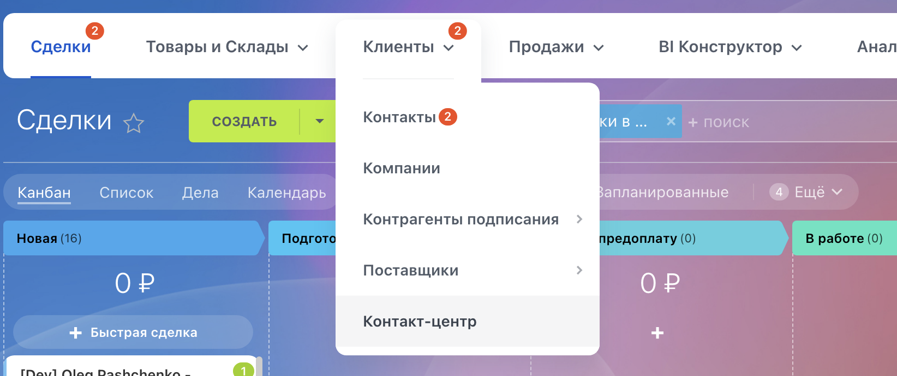
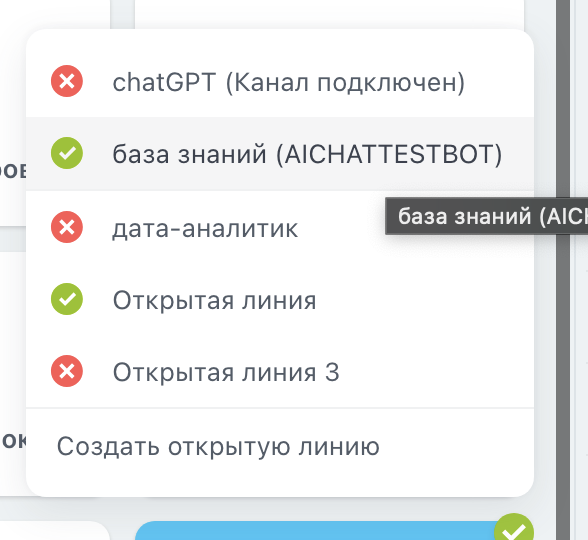
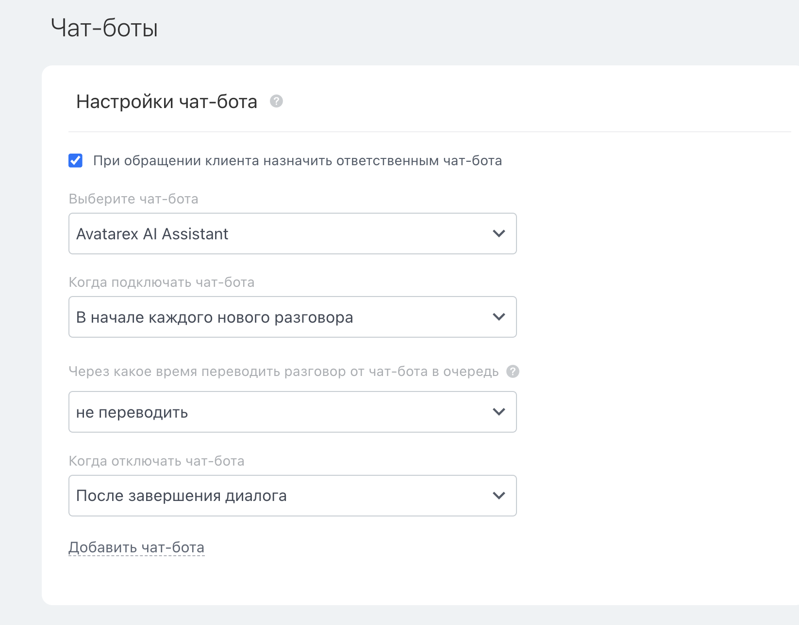

# Как привязать бота Avatarex в Bitrix на примере Telegram
- Данную инструкцию нужно выполнять строго ПОСЛЕ привязки bitrix к avatarex!

1) Заходим в настройку контакт центра

2) Выбираем телеграм и линию
   
3) В разделе настройка канала нажимаем на кнопку настроить
   
   
4) Заходим в раздел Чат-боты и выбираем Avatarex
   

<seealso>
<!--Give some related links to how-to articles-->
</seealso>
