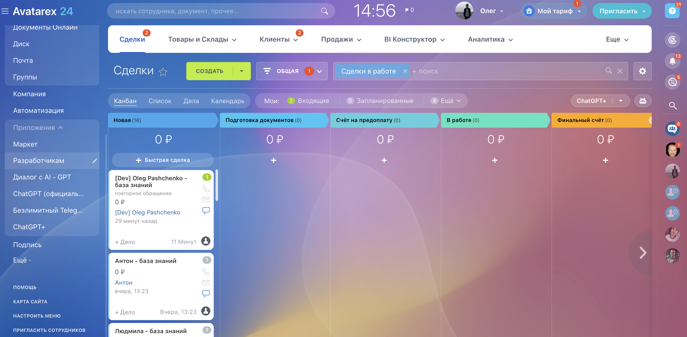

# Как связать ваш Bitrix с Avatarex

1) Зайти в меню Приложения и выбрать раздел разработчикам

2) Нажимаем Другое
   

3) Выбираем "Входящий вебхук"
   

4) В настройке прав выбираем "Создание и управление Чат-ботами (imbot) и CRM"
   
5) Копируем и вставляем в Avatarex вебхук для вызова rest api
   

6) Сохраняем в Bitrix и в Avatarex

<seealso>
<!--Give some related links to how-to articles-->
</seealso>
